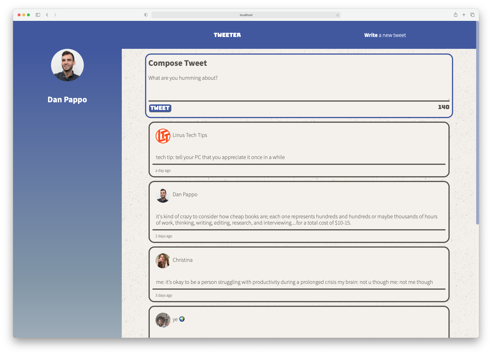
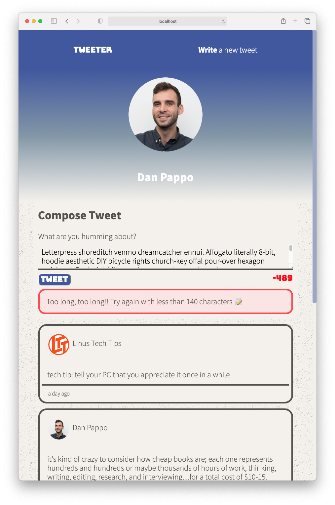

# Tweeter Project

Tweeter is a simple, single-page Twitter clone.

Built as a student project at [Lighthouse Labs](https://lighthouselabs.ca), this was a fun opportunity to practice HTML, CSS, JS, jQuery and AJAX front-end skills, and Node and Express back-end skills.

## Some features that I'm proud of
- Desktop and mobile responsive layouts a lá media query
- jQuery galore: especially the scroll down on nav bar compose click, and the border creation on focus on blur of new tweet textarea
- An imported selection of some of my favorite tweets
- Gorgeous error handling
- A coloured scrollbar

## Stretch!
In the desktop layout, I wanted my header height to grow according the length of the page; the linear gradient is lovely, but currently it tops out at the size of the view port on render.

## Getting Started

1. Fork this repository, then clone your fork of this repository.
2. Install dependencies using the `npm install` command.
3. Start the web server using the `npm run local` command. The app will be served at <http://localhost:8080/>.
4. Go to <http://localhost:8080/> in your browser.

## Dependencies

- Express
- Node 5.10.x or above
- Body-parser
- Chance
- Moment JS